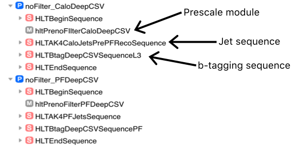

# nTupler
Creation of flat trees with HLT objects. For this the HLT has to be rerun on RAW. [Original Code](https://github.com/silviodonato/usercode/tree/NtuplerFromHLT2017_V8)

## Usage
The following steps are necessary to produce the ntuples.

### Custom HLT Menu
In order to rerun the b-tagging on every event/jet instead of only running it when the modules are reached in a path, a custom HLT menu has t be created. Use the CMS [ConfDBGUI](https://twiki.cern.ch/twiki/bin/viewauth/CMS/EvfConfDBGUI). As a starting point create a new menu in the version of the main HLT menu you want to use and deep import a stable path with b-tagging (this ensures you have the most resent versions of the b-tagging modules/sequences). Then create new path for Calo and PF b-tagging with the following modules/sequences:



These paths run the jet and b-tagging sequences for Calo and PF jets in every event without filtering you any. The deep imported b-tagging path can be removed after this. Furthermore all paths that should be present in the nTupler also need to be copied to this new custom menu. The default setting of the nTupler only keeps events that pass at least one of the `HLT_*`paths in the custom menu.

### HLT config
Creating of config dump for running the RAW+MiniAOD files with HLT. The HLT tables and `--setup` depend on the usecase. For the most recent menu/runs check instructions on [HLT Twiki](https://twiki.cern.ch/twiki/bin/view/CMSPublic/SWGuideGlobalHLT).

#### For Data:
```bash
hltGetConfiguration /users/koschwei/CMSSW_9_2_10/HLT_TnP_BTag_Phase1v2/V2 \
 --setup /dev/CMSSW_9_2_0/GRun/V140 \
 --data --globaltag 94X_dataRun2_ReReco_EOY17_v1 \
 --input root://cms-xrd-global.cern.ch//store/data/Run2017C/MuonEG/RAW/v1/000/299/368/00000/00E9C4F1-E76B-E711-8952-02163E01A27B.root  \
 --process MYHLT --full --offline   \
 --unprescale --max-events 10 --output none > hltData.py
```
Add 
```python
process.GlobalTag.toGet.append(
	cms.PSet(
		record = cms.string("SiPixelGainCalibrationForHLTRcd"),
		tag = cms.string("SiPixelGainCalibrationHLT_2009runs_hlt"),
		connect = cms.string("frontier://FrontierProd/CMS_CONDITIONS")
	)
)
```
just below
```python
if 'GlobalTag' in process.__dict__:
    from Configuration.AlCa.GlobalTag import GlobalTag as customiseGlobalTag
	process.GlobalTag = customiseGlobalTag(process.GlobalTag, globaltag = '94X_dataRun2_ReReco_EOY17_v1')
```
and then do
```bash
edmConfigDump hltData.py > hlt_dump_phase1.py
cmsRun  hlt_dump_phase1.py &> cmsRunData.log
```
#### For MC:
```bash
hltGetConfiguration /users/koschwei/CMSSW_9_2_10/HLT_TnP_BTag_Phase1v2/V2 \
 --setup /dev/CMSSW_9_2_0/GRun/V140 \
 --mc --globaltag 94X_mc2017_realistic_v11 \
 --input root://cms-xrd-global.cern.ch//store/mc/RunIIFall17DRPremix/TTTo2L2Nu_TuneCP5_13TeV-powheg-pythia8/GEN-SIM-RAW/TSG_94X_mc2017_realistic_v11-v1/30000/0416D117-B31E-E811-848B-3417EBE64CDB.root  \
 --process MYHLT --full --offline   \
 --unprescale --max-events 10 --output none > hltMC.py

edmConfigDump hltMC.py > hlt_dump_mc_phase1.py
cmsRun hlt_dump_mc_phase1.py &> cmsRunMC.log
```

Check `cmsRunMC.log` and/or `cmsRunMC.log` if rerunning the HLT finishes without errors.

For runnning the nTupler the following changes to the configs are required:

__Add__ to the `process.source` in the __beginning of the file__ `lumisToProcess = cms.untracked.VLuminosityBlockRange( )`, so it looks like this:
```python
process.source = cms.Source("PoolSource",
    fileNames = cms.untracked.vstring('root://cms-xrd-global.cern.ch//store/data/Run2017C/MuonEG/RAW/v1/000/299/368/00000/00E9C4F1-E76B-E711-8952-02163E01A27B.root'),
    lumisToProcess = cms.untracked.VLuminosityBlockRange( ),
    inputCommands = cms.untracked.vstring('keep *')
)
```

__Remove__
```python
process.DQMOutput = cms.EndPath(process.dqmOutput)
```

__Add__ the following for MC (MiniAODv1)
```python
from RecoEgamma.EgammaTools.EgammaPostRecoTools import setupEgammaPostRecoSeq
setupEgammaPostRecoSeq(process,applyEnergyCorrections=False,
                       applyVIDOnCorrectedEgamma=False,
                       isMiniAOD=True)
					   
process.p = cms.Path(process.egammaPostRecoSeq)
```

__Add__ the following to the __end of the the config__ dump:
```python
process.hltOutputFULL = cms.OutputModule("PoolOutputModule",
                                         dataset = cms.untracked.PSet(),
                                         fileName = cms.untracked.string('./cmsswPreProcessing.root'),
                                         outputCommands = cms.untracked.vstring('drop *',
                                                                                'keep *Egamma*_*_*_*',
                                                                                'keep bool*ValueMap*_*Electron*_*_*',
                                                                                'keep l1t*_*_*_*',
                                                                                'keep *_*Ht*_*_*',
                                                                                'keep *Jet*_*_*_*',
                                                                                'keep *Electron*_*_*_*',
                                                                                'keep *Muon*_*_*_*',
                                                                                'keep *Track*_*_*_*',
                                                                                'drop *Track*_hlt*_*_*',
                                                                                'drop SimTracks_*_*_*',
                                                                                'keep *SuperCluster*_*_*_*',
                                                                                'keep *MET*_*_*_*',
                                                                                'keep *Vertex*_*_*_*',
                                                                                #######
                                                                                'keep *_genParticles_*_*',#AOD
                                                                                'keep *_prunedGenParticles_*_*',#MINIAOD
                                                                                #######
                                                                                'keep *genParticles_*_*_*',
                                                                                'keep *Trigger*_*_*_*',
                                                                                'keep recoJetedmRefToBaseProdTofloatsAssociationVector_*_*_*',
                                                                                #######
                                                                                'keep *_addPileupInfo_*_*', #AOD
                                                                                'keep *_slimmedAddPileupInfo_*_*',#MINIAOD
                                                                                #######
                                                                                'drop *_*Digis*_*_*',
                                                                                'drop triggerTriggerEvent_*_*_*',
                                                                                'keep *_hltGtStage2Digis_*_*',
                                                                                'keep *_generator_*_*')
)
process.FULLOutput = cms.EndPath(process.hltOutputFULL)
```

__Important:__ check if MINIAOD or AOD will be used and set `dataFormat` for VID ID tools accordingly!


#### Changing from AOD to MiniAOD (or vice versa)
* Change `dataFormat = DataFormat.AOD` to `dataFormat = DataFormat.MiniAOD` in the python config
* Set `runAOD` in `ntuplizerHLT.py` to `False`

### Local test
Edit `crab/PSet_localTest.py`to fit your needs.
```bash
cd crab
ln -s ../ntuplizerHLT.py fwlite_config.py
cp ../hlt_dump.py .
cp ../hlt_dump_mc.py .
python script.py 0 &> script.log
```


### CRAB
Edit 'crab/multicrab_config.py'. The main thing to check are:
* Datasets: Follow the description in the top of the file
* name
* `config.Data.unitsPerJob`
* `config.Data.unitsPerJob`
* `config.Data.outLFNDirBase`
* If data is processed: `config.Data.lumiMask`
* `config.Site.storageSite`

Run it with `python multicrab.py`

## PU reweighting
1. Get pilup JSON and PromptReco JSON from `/afs/cern.ch/cms/CAF/CMSCOMM/COMM_DQM/certification/Collisions17/13TeV/`
2. Edit the PrompReco JSON to only include the run(s) that will be processed 
3. Follow the instuction from [PUreweighting Twiki](https://twiki.cern.ch/twiki/bin/viewauth/CMS/PileupJSONFileforData)
4. Example : `pileupCalc.py --maxPileupBin 90 --numPileupBins 90 --minBiasXsec=69200 --inputLumiJSON=pileup_latest.txt --calcMode true -i ???_13TeV_PromptReco_Collisions17_JSON.txt output.root`
5. Use `puHCalc.py output.root`
6. To reweight, get the  `.getTrueNumInteractions()` from the `addPileupInfo`(in AOD) collection and find the *bin* in the PUHisto corrsesponding to that value. The bin height is the reweighting factor.

## Generate JSON file for limited PU range
If the MC sample is generated with a PU range smaller than in data, the script `getJSONforPUrange.py` can be used to remove all LS from the PromptReco JSON with PU outside a certain range, that can be set in script. This JSON can then be used as lumimask in the crab configuration.

## Contents (WiP):
### Leptons
nTuple contains collections for *tight* and *loose* Electrons and Muons. These WP are definied according to this [electron recommendation](https://twiki.cern.ch/twiki/bin/view/CMS/CutBasedElectronIdentificationRun2) and this [muon recommendation](https://twiki.cern.ch/twiki/bin/view/CMS/SWGuideMuonIdRun2). All leptons have saved their pT, eta and phi. To further furfill required analysis cuts, muon contain also *iso* and electrons *superClusterEta*.

### Jets
nTuples contain collections for *caloJets*, *pfJets* (online) and ak4PfCHS *offJets* and *genJets* (offline) which are interliked via a DeltaR < 0.3 matching criteria. 

# Rescaling of Datasets
## Calculating lumi for the processed data
If all job of the Data finished, the json with all processed lumi sections can be found using `crab report` which writes it to `results/inputDatasetLumis.json`.

With the JSON [file brilcalc](https://twiki.cern.ch/twiki/bin/view/CMS/TWikiLUM#CurRec) can be used to calculated the integrated lumi on *lxplus*:
```bash
export PATH=$HOME/.local/bin:/afs/cern.ch/cms/lumi/brilconda-1.1.7/bin:$PATH
#Check normtag on twiki page
brilcalc lumi -u /pb --normtag /cvmfs/cms-bril.cern.ch/cms-lumi-pog/Normtags/normtag_BRIL.json -i pocessedLS.json 
```

## Getting number of events processed in MC dataset
The outputfiles contain a histogram with the count of processed events. 


